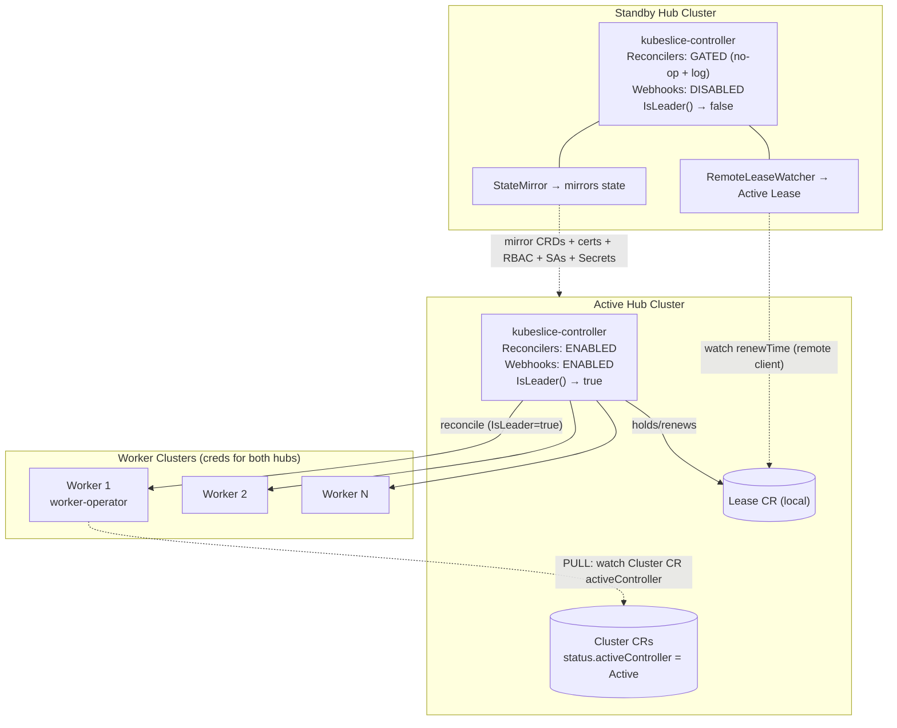
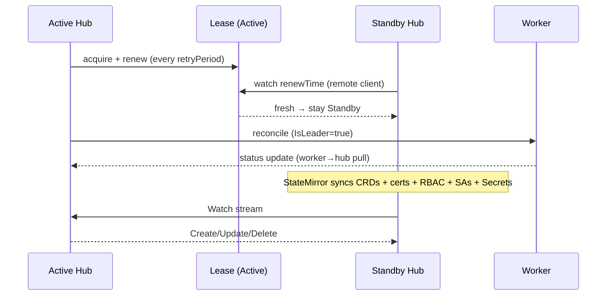
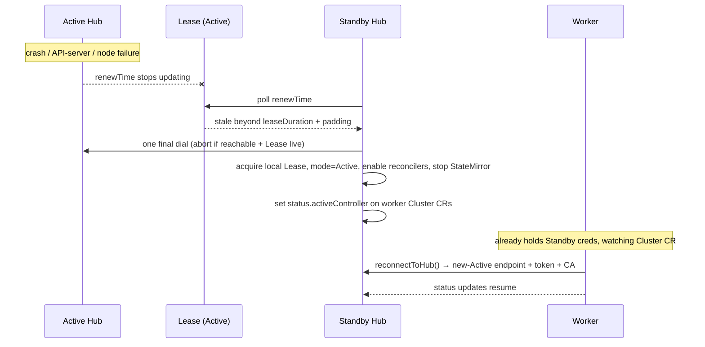

# ADR: Active/Standby HA for KubeSlice Controller

| Field | Value |
|---|---|
| Status | Proposed |
| Author | Sumanth D |
| Mentors | Gourish Biradar, Prabhu Navali, Rahul Kumar |
| Date | 2026-06-24 |
| Issue | #293 |
| Downstream | #294, #295, #297, #298, #299, worker-operator #467–#469 |

---

## Context

The KubeSlice controller today runs as a single process in one dedicated hub cluster. 

This ADR introduces a second hub cluster that continuously mirrors the first and takes over automatically when the first fails.

**Scope note.** This is about two separate Kubernetes clusters acting as hubs — not multiple pods of one controller in a single cluster. The `--leader-elect` flag in `main.go` (controller-runtime in-cluster leader election, `LeaderElectionID: "6a2ced6b.kubeslice.io"`, default off) handles the pod-replica case and is orthogonal to this work; it is left untouched.

**Terminology.** "Active" and "Standby" are the two roles. One cluster holds Active and the other Standby; after a failover those roles swap.

---

## Goals

- The Standby becomes the writable hub within ~one Lease duration of Active failure.
- All KubeSlice state — the CRDs plus the gateway certificates, RBAC, and credential objects workers depend on — is present on the Standby at the moment of failure.
- Only one hub writes to worker clusters at any time.
- Workers reconnect to the new Active automatically, with no manual reconfiguration.

## Non-Goals

- **Split-brain during a network partition between two healthy hubs** (Decision 8 — documented as a known limitation).
- **Northbound HA:** repointing the clients that *create* Slices (kubectl / GitOps / UI) at the Standby. After failover, workers reconnect, but creating new Slices requires whoever drives the hub API to target the new Active.
- Graceful handoff / pre-stop lease transfer.
- More than two hub clusters.
- Automatic re-join of a recovered failed hub — for MVP it re-joins as Standby by manual redeploy.

---

## Components



---

## Decisions

### 1. Where does the Lease live?

**On the Active hub's own API server**, in the controller's own namespace. The Standby watches it via a remote client.

**Namespace, precisely.** This is not a hardcoded literal. Both hubs read their own namespace at startup from the downward API — the manager `Deployment` injects `KUBESLICE_CONTROLLER_MANAGER_NAMESPACE` via `fieldRef: metadata.namespace` (`config/manager/manager.yaml`), and `--ha-lease-namespace` defaults to that value (falling back to a package default only for local, non-downward-API runs). In the default kustomize layout (`config/default/kustomization.yaml`) that namespace is `kubeslice-controller` — where the controller **software** runs on the hub. This is a different namespace from `kubeslice-system`, which only exists on **worker** clusters (worker-operator, NSM, gateways, DNS) and is never present on a hub; the two are not interchangeable, and every hub-side reference in this ADR means `kubeslice-controller`.

This gives natural fencing: if the Active's API server goes down, it loses the ability to renew its Lease and to write to workers at the same time — both go through that API server. Placing the Lease on the Standby was rejected because a transient Active→Standby network blip would then look like Active death and cause false failovers.

### 2. How does the Standby get credentials to the Active?

**A kubeconfig stored as a Secret in the Standby cluster**, mounted into the controller pod. An operator creates a read-only `ServiceAccount` on the Active (access to `coordination.k8s.io/leases` and the mirrored types), and its kubeconfig goes into a Secret in the Standby's own namespace — the same downward-API-derived namespace as Decision 1 (`kubeslice-controller` in the default deployment):

```yaml
apiVersion: v1
kind: Secret
metadata:
  name: active-hub-kubeconfig
  namespace: kubeslice-controller  # the Standby's own namespace (KUBESLICE_CONTROLLER_MANAGER_NAMESPACE)
type: Opaque
data:
  kubeconfig: <base64-encoded kubeconfig>
```

The Standby builds one remote client from it at startup, shared by `RemoteLeaseWatcher` and `StateMirror`.

### 3. How is leader election implemented?

**A custom `ClusterLeaderElector` in `pkg/ha/`** (not `--leader-elect`, which only coordinates pods on the same API server).

```go
type ClusterLeaderElector struct {
    localClient  client.Client  // own cluster — renew the Lease
    remoteClient client.Client  // Standby only — watch the Active's Lease
    mode         HAMode         // Active | Standby | Standalone
}

func (e *ClusterLeaderElector) IsLeader() bool
func (e *ClusterLeaderElector) StartLeaseRenewal(ctx context.Context) error  // Active only
func (e *ClusterLeaderElector) WatchRemoteLease(ctx context.Context) error   // Standby only
```

Configurable: `leaseDuration`, `renewDeadline`, `retryPeriod`, `promotionGracePeriod`. Each of the nine reconcilers holds one of these as `LeaderElector *ClusterLeaderElector` (nil-safe — a nil elector, i.e. HA not wired, behaves as standalone); Decision 4's guard is what reads it.

### 4. Fencing model — how is only-Active-writes guaranteed?

**A per-call `IsLeader()` guard at the top of every reconciler.** Each `Reconcile` today is a thin wrapper over `util.PrepareKubeSliceControllersRequestContext(...)` plus a service call, so the guard slots in cleanly:

```go
func (r *SliceConfigReconciler) Reconcile(ctx context.Context, req ctrl.Request) (ctrl.Result, error) {
    if r.LeaderElector != nil && !r.LeaderElector.IsLeader() {
        r.Log.Info("standby mode, skipping reconcile")
        return ctrl.Result{}, nil
    }
    kubeSliceCtx := util.PrepareKubeSliceControllersRequestContext(ctx, r.Client, r.Scheme, "SliceConfigController", r.EventRecorder)
    return r.SliceConfigService.ReconcileSliceConfig(kubeSliceCtx, req)
}
```

The guard is added to all **nine** reconcilers registered in `main.go` (`Project`, `Cluster`, `SliceConfig`, `ServiceExportConfig`, `WorkerSliceGateway`, `WorkerSliceConfig`, `WorkerServiceImport`, `SliceQoSConfig`, `VpnKeyRotation`) and is evaluated on every call, not once at startup. On the Standby, the webhook servers are disabled (`ENABLE_WEBHOOKS=false`) so they don't reject the objects `StateMirror` writes.

**Every process `main.go` starts, and which role it runs under.** `--ha-mode` does not change *which* goroutines start — the table below is identical on both roles except the last three rows. What changes is (a) which one of the two HA loops runs, and (b) whether webhook registration and the reconcile *bodies* actually write:

| Process | Started by | Active | Standby |
|---|---|---|---|
| controller-runtime metrics server (`--metrics-bind-address`) | `mgr.Start()` | always runs | always runs |
| Custom Prometheus / event-counter server (`metrics.StartMetricsCollector`) | explicit `go` in `main.go`, before `mgr.Start()` | always runs | always runs |
| Health-probe server (`/healthz`, `/readyz`) | `mgr.Start()` | always runs | always runs |
| In-cluster `--leader-elect` (pod-replica election, default off) | `mgr.Start()`, if `--leader-elect=true` | always runs | always runs |
| The nine reconcilers' watch/workqueue loops | `SetupWithManager`, before `mgr.Start()` | always runs — body writes | always runs — body no-ops via `IsLeader()` guard |
| Webhook servers (validating/mutating) | `SetupWebhookWithManager`, gated on `ENABLE_WEBHOOKS` | registered + enforced | **not registered at all** (`ENABLE_WEBHOOKS=false`) |
| `ClusterLeaderElector.StartLeaseRenewal` | explicit `go` in `main.go` | Active only | — |
| `ClusterLeaderElector.WatchRemoteLease` | explicit `go` in `main.go` | — | Standby only |
| `StateMirror` (#295/#297) | planned | — | Standby only |

One correction from an earlier draft: there is no separate "`VpnKeyRotation` timer" goroutine. `VpnKeyRotationReconciler` is wired through `SetupWithManager` exactly like the other eight reconcilers — its watch loop always starts on both roles, and its `Reconcile` body carries the identical per-call `IsLeader()` guard shown above. `--ha-mode` never adds or removes a goroutine from the first six rows; it only selects which of the last three runs.

If the Active's own API server is down it can't renew and can't write — natural fencing.

**Security note — what `ENABLE_WEBHOOKS=false` is, and isn't.** Disabling webhooks on the Standby is what lets `StateMirror` write mirrored objects without the Standby's own admission webhooks rejecting them — but that same disabled validation applies to anything else written to the Standby's API server. If an operator applies a `SliceConfig` (or any other webhook-validated object) directly to the Standby while it holds that role — a stale `kubectl` context, a GitOps pipeline pointed at the wrong cluster — it will be accepted without the validation it would get on the Active. `ENABLE_WEBHOOKS=false` is a deployment-level convenience that unblocks the mirror; it is **not** a security boundary. The actual boundary has to be that the Standby's API server is not reachable by ordinary clients while it is Standby — network policy, no exposed Ingress/LoadBalancer/route, and RBAC scoped so only the mirror's own credential can write. That's an operational requirement of running the Standby, not something the controller enforces in code.

### 5. What triggers promotion?

**The Active's Lease `renewTime` not updating within `leaseDuration + paddingSeconds`.** On detecting a stale Lease, the Standby does one final dial to the Active's API server; if it's reachable and the Lease is live, it aborts (transient blip). Otherwise it acquires the Lease on its own cluster, sets `mode = Active`, enables reconcilers, stops `StateMirror`, sets the `activeController` marker on the worker `Cluster` CRs, and emits a Kubernetes Event and increments `ha_failover_total`.

### 6. Which resources are mirrored, and how?

`StateMirror` runs on the Standby only. It opens a Watch against the Active for each type below and applies the three event paths — Create (strip `resourceVersion`, `uid`, and `finalizers`), Update (strip `finalizers`), Delete — to the Standby's local API server. It exposes `ha_sync_lag_seconds` (time between a change on the Active and its appearance on the Standby).

Mirroring only the KubeSlice CRDs is not enough — a promoted hub also needs the gateway key material and the authorization that lets workers function (the controller already owns RBAC for `serviceaccounts`, `secrets`, `namespaces`, and `roles/rolebindings/clusterroles`):

| Resource | Group |
|---|---|
| `Project`, `Cluster`, `SliceConfig`, `ServiceExportConfig`, `SliceQoSConfig`, `VpnKeyRotation` | `controller.kubeslice.io` |
| `WorkerSliceConfig`, `WorkerSliceGateway`, `WorkerServiceImport` | `worker.kubeslice.io` |
| Gateway VPN cert `Secret`s (OpenVPN/WireGuard), CA/issuer `Secret`s, worker kubeconfig `Secret`s | `core/v1` |
| `ServiceAccount` objects for worker identities | `core/v1` |
| `Role` / `RoleBinding` / `ClusterRole` / `ClusterRoleBinding` for worker identities | `rbac.authorization.k8s.io` |
| `Namespace` (`kubeslice-*`) — applied first so dependents can land | `core/v1` |

**Finalizers and deletes (resolved).** Objects like `Cluster` and `SliceConfig` carry finalizers on the Active. If the mirror copied a finalizer verbatim, a delete on the Active would replay as a delete on the Standby, and the Standby's own finalizer-owning controller — gated `IsLeader()=false` — would never clear it, leaving the object stuck in `Terminating` forever and permanently drifting the Standby's view of the world away from the Active's. This must be settled before implementation, not deferred past MVP: **`StateMirror` strips every `finalizers` entry from an object on both Create and Update**, so nothing on the Standby ever carries a finalizer the gated controllers would need to remove — a Delete event then removes the object immediately, with nothing left pending. As a backstop for deletes the watch itself misses (a restart mid-event, a dropped and re-established watch), the periodic resync (`--ha-sync-interval`) diffs the Standby's mirrored set against a fresh list from the Active and prunes anything no longer present there.

**Exception:** hub-issued SA **tokens** are not mirrored. A token signed by the Active is invalid on the Standby, so the mirror carries the `ServiceAccount` + RBAC (the identity and authorization) and each hub mints its own token (Decision 7).

### 7. How do workers find the new Active after failover?

**Workers are provisioned with access to both hubs up front, and detect failover by pulling their `Cluster` CR.**

At registration a worker is given `endpoint` + `ca.crt` + `token` for **both** hubs — each hub mints its own worker credential through the existing registration path (`ClusterService` + `SecretService` + `AccessControlService`). The worker uses the Active's by default and already holds one valid against the Standby.

The authoritative "who is Active" signal is `status.activeController` on the worker's `Cluster` CR (`endpoint` / `caBundle` / `activeIdentity`), kept converged by the mirror. The worker-operator watches this; on promotion the new Active sets `activeController` to itself, and the worker calls `reconnectToHub()` — switching to its pre-held credentials for the new Active. worker-operator #467 re-architects the hub-client construction from a start-time `HUB_HOST_ENDPOINT` env var into a live watch that rebuilds the client without a pod restart, and surfaces the signal locally as a `ClusterController` CR so non-HA deployments (field absent/static) see no behavior change.

```yaml
# Cluster CR status, set by the promoted hub; mirrored to both hubs
status:
  activeController:
    endpoint: "https://<new-active>.example.com:6443"
    caBundle: "<base64 CA cert>"
    activeIdentity: "<new-active-identity>"
```

DNS failover was rejected (external DNS control; unpredictable TTL). Start-time env vars were rejected (need a pod restart; can't carry the credential switch).

### 8. Split-brain

**Explicit non-goal for MVP.** If a network partition isolates the two healthy hubs from each other, the Active keeps renewing its local Lease while the Standby can't see it and promotes — both would write to workers. This is documented as a known limitation; on partition heal an operator demotes one hub. Likewise, a recovered failed hub re-joins as Standby by manual redeploy rather than automatically.

---

## Normal-operation sequence



## Failover sequence



---

## New flags

| Flag | Default | Description |
|---|---|---|
| `--ha-mode` | `standalone` | `active`, `standby`, or `standalone` (HA disabled, default) |
| `--ha-identity` | hostname | Stable per-cluster identity in the Lease |
| `--ha-lease-namespace` | `KUBESLICE_CONTROLLER_MANAGER_NAMESPACE` (downward API) | Namespace for the HA Lease — the controller's own namespace, where the existing leader-election Role already grants `coordination.k8s.io/leases` |
| `--ha-lease-duration` | `15s` | Lease TTL |
| `--ha-renew-deadline` | `10s` | Give up on renewal after this |
| `--ha-retry-period` | `2s` | Lease acquire/renew poll interval |
| `--ha-padding-seconds` | `5s` | Extra buffer before promotion |
| `--ha-promotion-grace-period` | `10s` | Grace period around promotion |
| `--ha-active-kubeconfig` | `""` | Path to Active's kubeconfig (Standby only) |
| `--ha-sync-interval` | `60s` | StateMirror periodic resync period |
| `ENABLE_WEBHOOKS` (env) | `true` | Set `false` on the Standby Deployment |

---

## Open Issues

1. **Split-brain (dual-write):** neither the network-partition case nor the crash-recovery case (a recovered Active resuming alongside the promoted Standby) is fenced yet.
2. **Controller-history CR:** a durable CR recording current/past Active identity and a monotonic failover epoch, as the source of truth for leadership.
3. **Active failure mid-Slice-creation:** partial/in-flight state and the sync-lag data-loss window mean the promoted hub's reconcilers must be idempotent and the create may need re-issuing.
4. **Worker's failover-time detection of `status.activeController` — direction chosen, two details remain.** The field lives on the hub-side `Cluster` CR; a worker watching only the currently-Active hub can't observe a status change on an API server that just died, since the update lands on the *other* hub's copy instead. Direction: the worker runs two permanent, lightweight watches — one against each of its two fixed, pre-provisioned hub endpoints, never against "the Active" or "the Standby" since that role can flip. Each hub writes `activeController` about **itself**, locally, only when it currently holds leadership; a Standby's own copy (populated by `StateMirror` from the Active) still shows the Active's identity, not its own, so the rule "trust whichever endpoint is reachable and reports `activeController == that endpoint's own identity`" resolves correctly without the worker ever needing to know which role either hub currently holds — and without any failure-timeout tuning, since it's reacting to a self-declaration, not inferring a death. Two things this still depends on:
   - **Tie-break rule.** If a partition causes both hubs to simultaneously self-declare Active (the split-brain non-goal, Decision 8), the worker needs a deterministic rule so it doesn't oscillate — e.g., prefer the fresher Lease `renewTime`, or a static endpoint priority. Not solving split-brain, just keeping the worker's behavior single-valued when it happens.
   - **Credential prerequisite.** This assumes the worker already holds a valid, durable credential against both hubs (Decision 7). *How* the Standby mints that credential while its own registration reconciler is `IsLeader()`-gated off is the separate, still-open worker dual-credential mechanism question — this issue assumes it's solved, it doesn't solve it.

   Architecturally, the two `activeController` watches are permanent and never rebuilt — they decide *when* to rebuild the worker's one primary data-plane hub client (`WorkerSliceConfig` watch, status posts), which is what `reconnectToHub()` actually swaps. `worker-operator` #467 needs to land both pieces without conflating them into a single connection. Needs to be settled with the worker-operator maintainers before or alongside #467.

*(Finalizers and stuck-`Terminating` cleanup — previously listed here — is resolved in Decision 6: mirrored copies have `finalizers` stripped on write, with periodic prune-on-resync as a backstop for missed deletes. This was a blocking correctness issue, not a post-MVP item, so it's settled in the design rather than left open.)*

---

## References

- Kubernetes Lease API: `coordination.k8s.io/v1`
- `kubeslice-controller/main.go`: nine reconcilers, `ENABLE_WEBHOOKS` gate, `LeaderElectionID: "6a2ced6b.kubeslice.io"`
- Worker hub-client today: `worker-operator` `pkg/hub/manager`, `pkg/hub/hubclient` (`HUB_HOST_ENDPOINT`, `BearerTokenFile`)
- Downstream: #294 #295 #297 #298 #299 worker-operator#467 worker-operator#468 worker-operator#469
